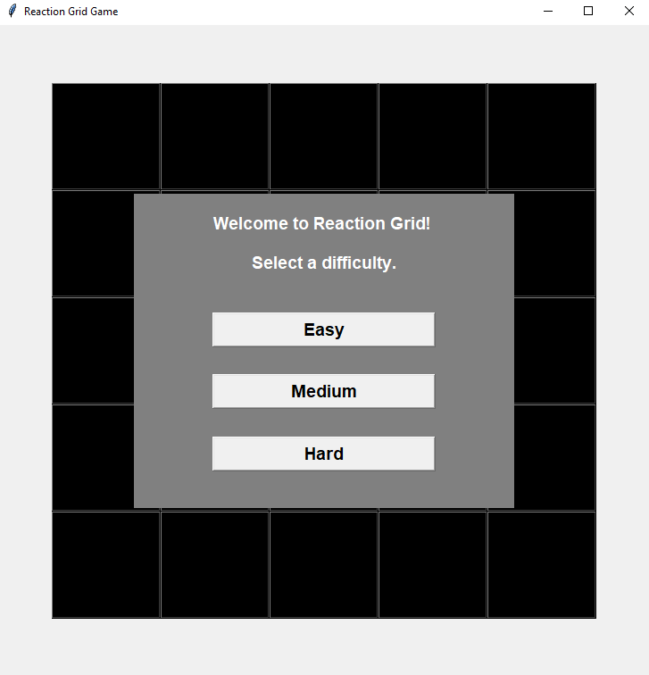
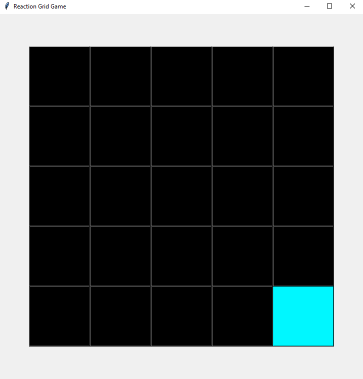
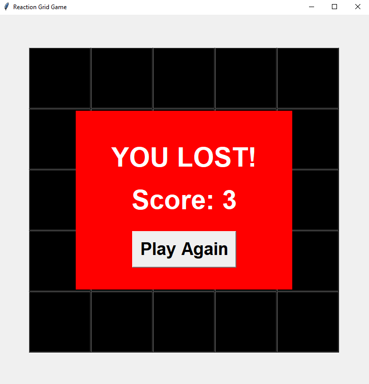

# reaction-grid

Simple reaction game using a 5x5 grid system.

The player needs to click the randomly-appearing squares without missing any. Once they miss, the game is over and the score is shown.

Has three difficulties - Easy, Medium & Hard.

## Example screenshots

